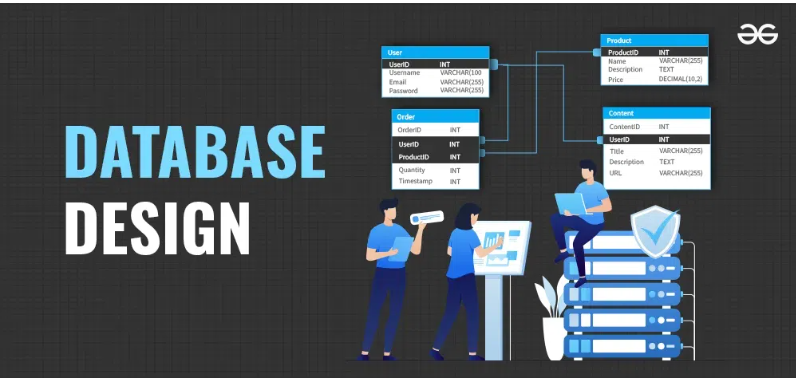

# Database Design and Development
Course Code: HTTP 5126

Academic Year: 2024-2025

This course provides strategies and techniques for designing, creating and interacting with a database. SQL and MySQL languages are the primary focus, with an introduction to NoSQL options.

# links
https://www.geeksforgeeks.org/database-design-ultimate-guide/

# Images

> **Notice** : This repository contains essential resources and code examples for database design and development. Familiarity with SQL and MySQL will be beneficial. NoSQL options are briefly introduced to broaden understanding, but the primary focus remains on relational database design.

# SQL:

######  1 
**A** 
SELECT * FROM `sales` WHERE item = 1014;
**B**
SELECT sales.date, stock_items.item 
FROM sales JOIN stock_items ON sales.item = stock_items.id 
WHERE sales.item = 1014;

######  2
**A**  
SELECT * FROM `sales` WHERE employee = 111;
**B**
SELECT sales.date, employees.first_name, employees.last_name, sales.item 
FROM sales JOIN employees ON sales.employee = employees.id 
WHERE sales.employee = 111;

######  3
**A** 
SELECT sales.date, sales.item, employees.first_name 
FROM sales JOIN employees ON sales.employee = employees.id 
WHERE sales.date BETWEEN '2024-09-12' AND '2024-09-18';
**B**
SELECT COUNT(sales.id), employees.first_name, employees.last_name 
FROM sales JOIN employees ON sales.employee = employees.id 
GROUP BY employees.first_name, employees.last_name 
ORDER BY COUNT(sales.id) DESC;

######  4
**A** 
SELECT sales.date, stock_items.item, stock_items.price, stock_items.category, employees.first_name 
FROM sales JOIN stock_items ON sales.item = stock_items.id 
JOIN employees ON sales.employee = employees.id 
WHERE sales.employee = (SELECT employees.id 
FROM sales JOIN employees ON sales.employee = employees.id 
GROUP BY employees.id 
ORDER BY COUNT(sales.id) DESC LIMIT 1);
**B**
SELECT COUNT(sales.id) AS 'Times Sold', stock_items.id, stock_items.item, stock_items.price, stock_items.category 
FROM stock_items LEFT JOIN sales ON stock_items.id = sales.item 
ORDER BY stock_items.id;

######  5
**A** 
 Provide the total item sales as "Total Sold" (sales), item name (stock_items) generated by all the employees and grouped by the employees. The result should show least sales to most sales. 
**B**
SELECT employees.first_name, employees.last_name, stock_items.item, SUM(sales.item) AS 'Total Sold'
FROM sales
JOIN employees ON sales.employee = employees.id
JOIN stock_items ON sales.item = stock_items.id
GROUP BY employees.first_name, employees.last_name
ORDER BY 'Total Sold' ASC;

